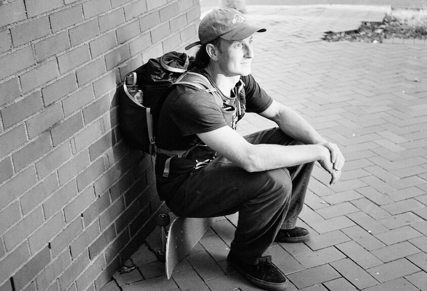

Hey - I'm Will and this is my website.

I'm interested in a lot of things. This site contains a portfolio centered around documentation of projects, findings, and curiosities. It's a visual manifestation of an [Obsidian vault](simons.dev%20-%20Nuxt%20Content%20+%20Obsidian.md) paired with [Nuxt](Nuxt.md).

Currently I live in [San Francisco](San%20Francisco), my hometown. Previously I lived in Seattle for 6 years. Between then and now I lived in [Bombay Beach, CA](Bombay%20Beach.md) for two winters. I [travelled](areas/Adventure.md) a bit between those two winters.

For work, I'm currently a freelance software developer.  I have had a good work/life balance with this, making just enough to live my life. I've now reached the point where I'm ready for a more full-time position.

[Skateboarding](Skateboarding) is a big part of my life. It has lead me on many great adventures, kept me healthy, and provided an outlet when everything else fails (or seems to). The diy ethos and vibrant community bring me so much joy.

Art - am I an artist? I make art. I tried writing an [Artist Statement](thoughts/Artist%20Statement%20(work%20in%20progress).md) to apply for a grant. My mediums are multi-media ~~ wood, video, sculpture, sound, code, light.

