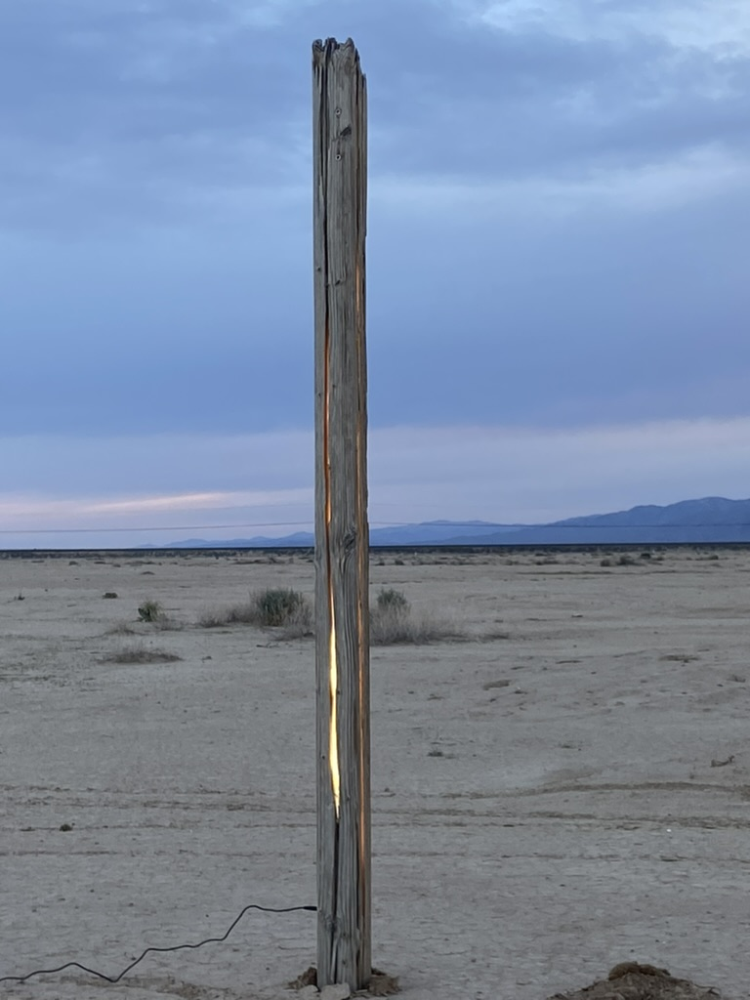
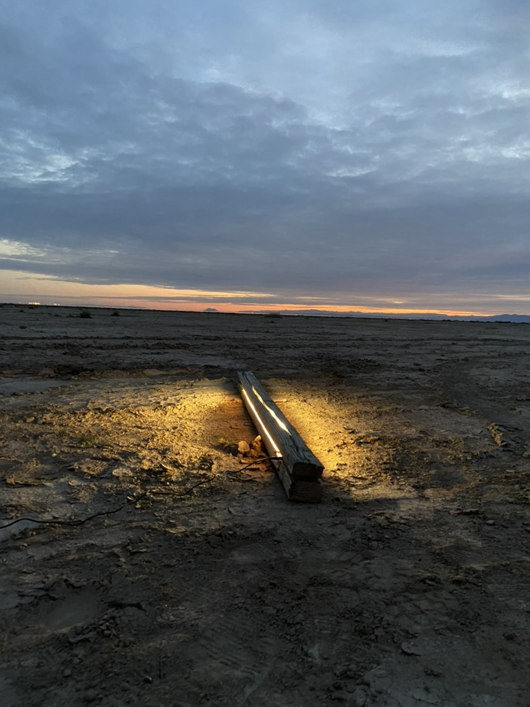

## Light Pier

Like most old piers, the deck is gone and just the vertical piers left standing. These beams are special though, they have been soaked in the mineral rich Salton Sea and glow at night.

Solar lights for an abandoned pier. Sink 4x4s in to water, with solar activated lights. Two rows spaced 4' apart, extending in to the water with beams every 8 feet extending out 32 feet in to the water. These will cast light on to the water, as well as under the water (if can get right LED components)

## **Approximate** Size:
4 feet wide, 32 feet long, ~4 feet tall above water on average

##  **Materials**: 
- 16 8' 4"x4" lumber
- 128' waterproof led strips
- Perhaps some rebar or ground screws to secure the posts upright in the water

