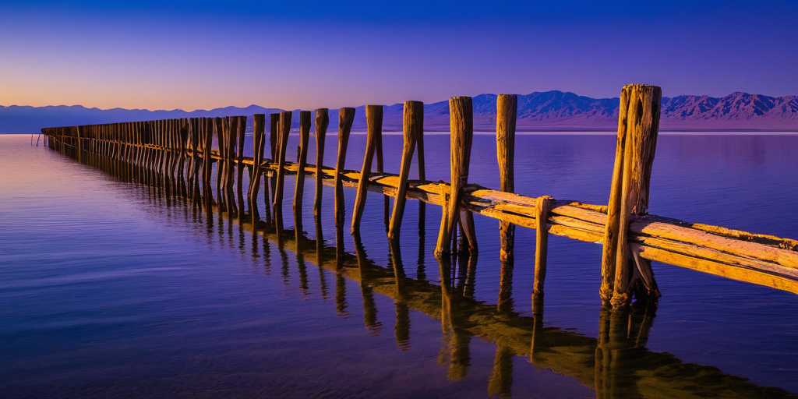
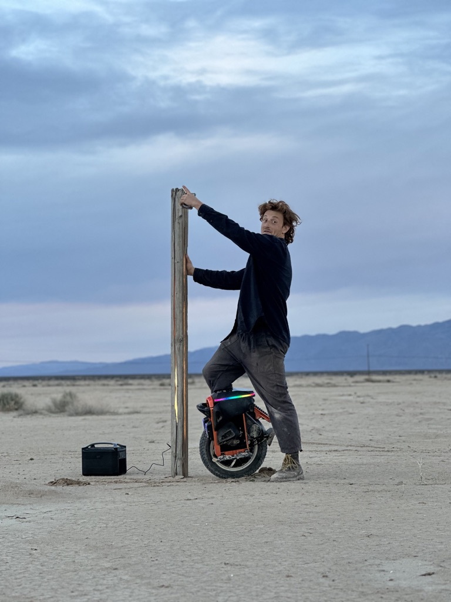

My creative motivations are centered around immediacy, utility, re-use, aesthetic comedy, joy. I work in parallel, circling around problems until the orbit becomes small enough I know I've arrived.  
  
I work with structural materials, wood, metal, brackets, LEDs. All things I've picked up thanks to a bit of curiosity and the internet.  
  
I lived in Seattle for 5 years, and regularly spent time at the Courts, DIY skatepark in Capitol Hill in Seattle. I gained the nickname "Courts Carpenter" one summer because I showed up regularly to sweep, fix broken ramps, and toss out trash.  
  
I currently live at and attend Mars College, an off-grid pop-up college in the Sonoran desert next to the town of Bombay Beach at the Salton Sea. Current projects are centered around trains, wood, clay, and scorpions.

##  Proposals
[Scorpion Hotel](Scorpion%20Hotel.md)
> 

[Light Piers Through](Light%20Piers%20Through.md)

