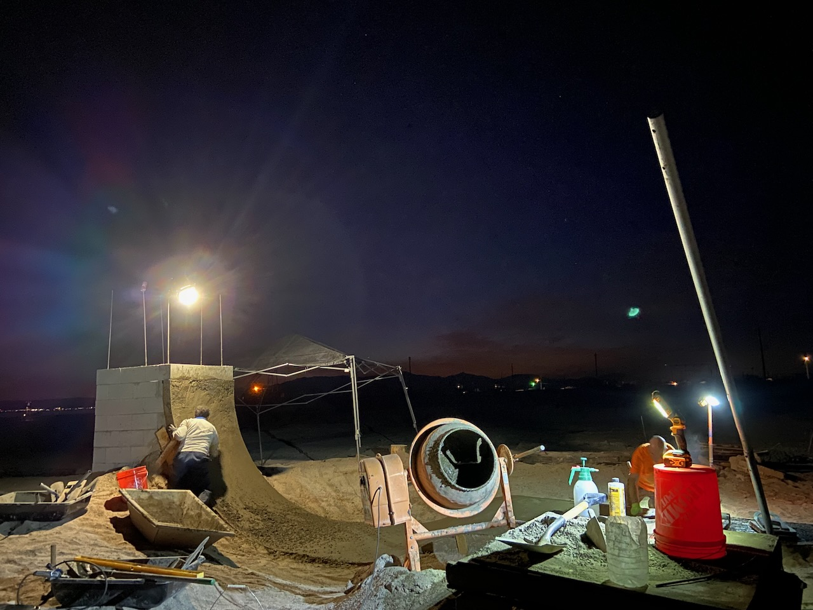
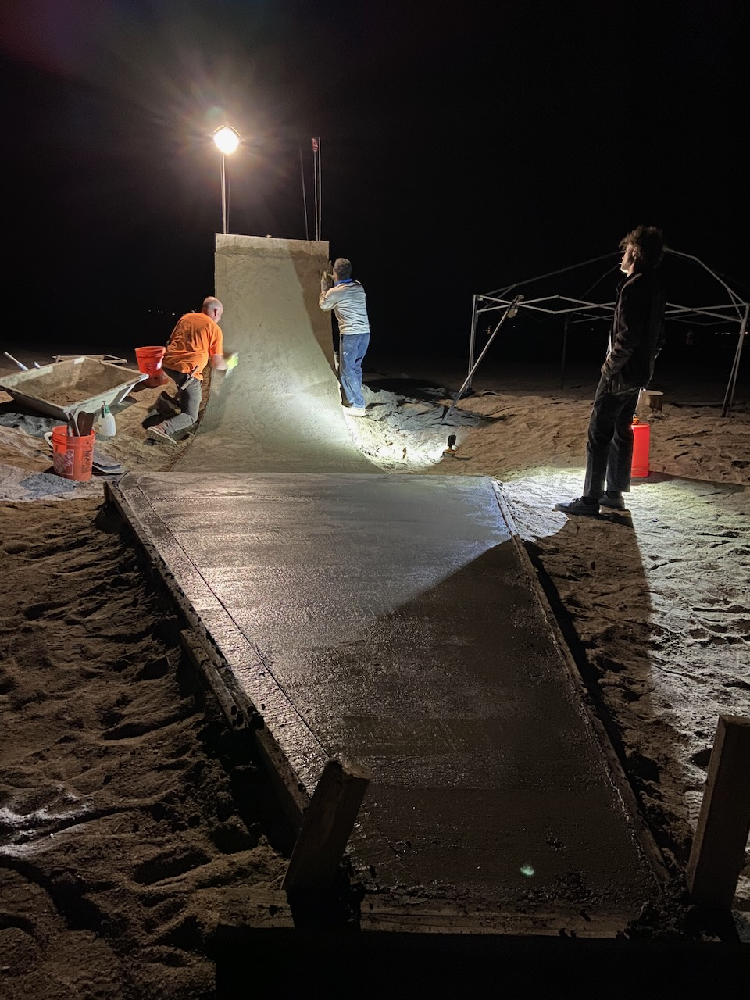
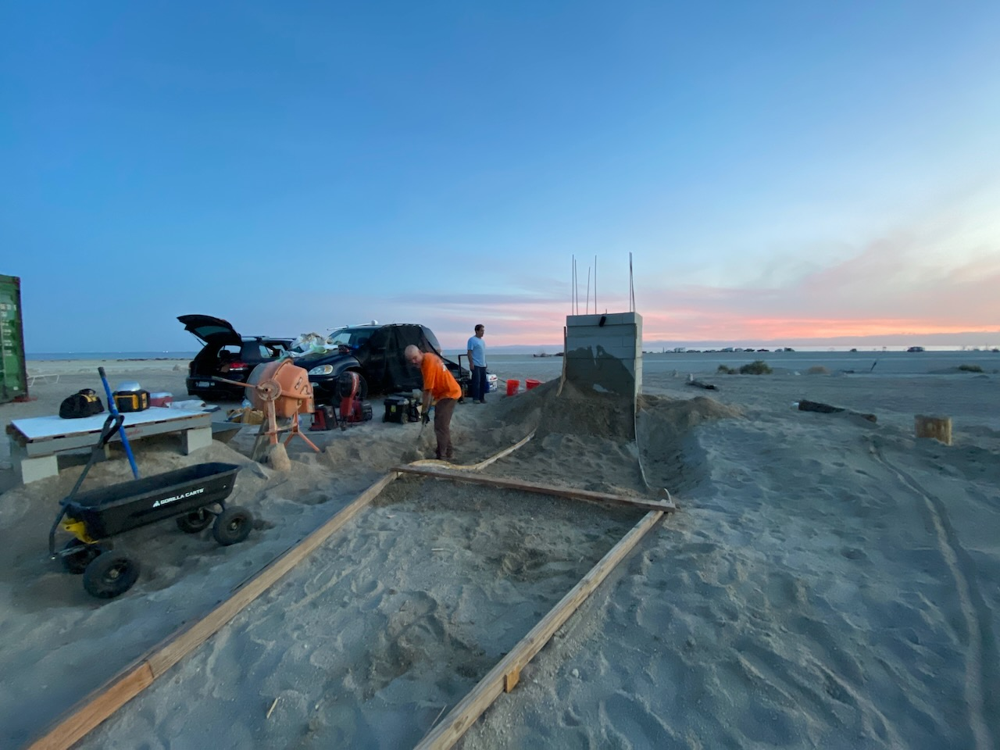

We built a giant concrete skate ramp on the beach of Salton Sea next to Bombay Beach.

`Update 2024-10-09`
Ian from Jenkem Skateboard magazine made a short doc on the project :)

<iframe width="100%" height="315" src="https://www.youtube-nocookie.com/embed/TjsDXeXDIbU?si=6Z_VG7Jei-glGV_b" title="YouTube video player" frameborder="0" allow="accelerometer; autoplay; clipboard-write; encrypted-media; gyroscope; picture-in-picture; web-share" referrerpolicy="strict-origin-when-cross-origin" allowfullscreen></iframe>

[Bombay Beach](../places/Bombay%20Beach.md) needs a skatepark. 
I was connected to Tyler Hammond through a Bombay Beach WhatsApp group, we both wanted to build a skate ramp. Tyler had the vision.

A bell tower, quarter pipe, wave pump. Massive. A real bell.

He had a guy - that guy is Clayton Graul, a prolific DIY builder and the mastermind behind the [@SkateDIY](https://www.instagram.com/skatediy/) instagram account.

I said I'm down, if you show up with some materials and ready to go, I'll put in work.

So now there is a dope skate ramp on the beach in Bombay Beach. To be continued..

