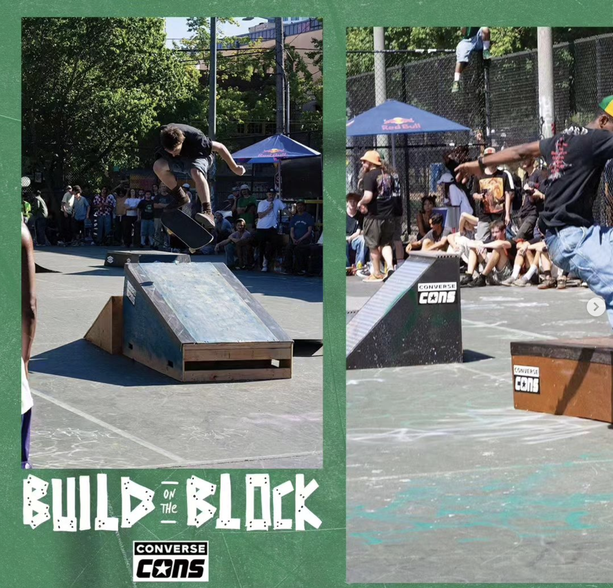

I was commissioned to build a ramp for the Build on the Block contest in Seattle. My usual ramp building process is to plan on paper, and usually improvise on the spot with construction. Since I was being paid (really just material cost plus a burger) and I was using new material, I decided to be more thorough. 

<iframe width="100%" height="315" src="https://www.youtube-nocookie.com/embed/DrYrWxnFtnQ?si=6WtI-Pzb0bLAeqsU" title="YouTube video player" frameborder="0" allow="accelerometer; autoplay; clipboard-write; encrypted-media; gyroscope; picture-in-picture; web-share" referrerpolicy="strict-origin-when-cross-origin" allowfullscreen></iframe>

Above is a side-by-side of the 3d design and a 3d scan of the built object. Dimensions are correct! (The final digital design is the all purple).

## Design

The project started with some hand drawn sketches. I took these in to Sketchup and created a 3d mockup. This allowed me to easily iterate and modify dimensions, angles, etc. as well as plan for a bill of materials.

## Angle Iron
I purchased 3" by 5" steel angle iron - the issue with standard 2" or 1.5" that you get from a hardware store is that it doesn't provide a surface for board tails or wheels to slide against. Since there was a budget, I went with some more serious angle.

### Threaded from the underside.
Additionally, I drilled holes and threaded the angle iron so that I could bolt it from the underside. The idea was to avoid the common dilemna of screws sticking up from angle iron screwed from the top. When the ledge gets skated enough, the screws start backing out, and you can catch your board on it. You get flung off and it can damage your board.  By bolting in from the underside with some locktite, we avoid this failure point.

## Dimensions

I built this to fit in my small 2012 Ford Transit Connect van. The fit was perfect.

## Learnings
- Ramps are steeper in real life than they appear in designs. 
- Budget time for painting. I ended up with a once over of spray paint to give it something....