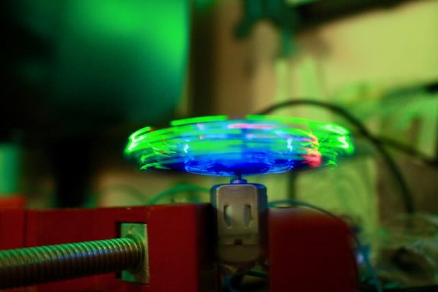
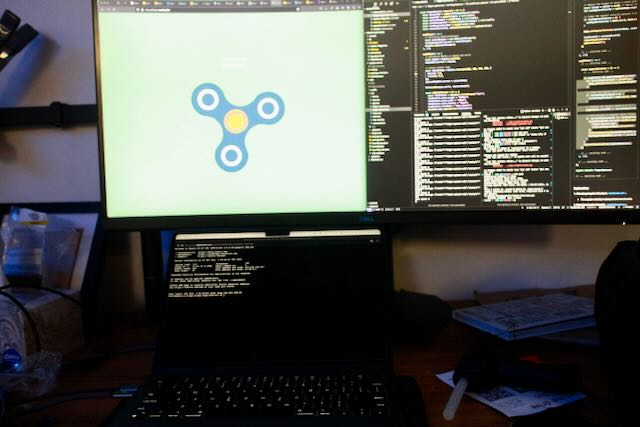

`a week of nights-and-weekends DIY skill-share workshops, creative make-athons, and an exhibition for restless hands to conjure.`
{style="margin: 0 auto; max-width: 100px"}

Having just moved back to San Francisco, I wanted to check out the maker / creative tech scene. A Fidget Camp call-for-makers link was shared in a Discord I'm a part of. Perfect!

There were classes taught by other attendees, followed by a group exhibition of work to wrap things up. It checked off a goal of mine, to show something I made in a group show.

### Group Exhibition
My contribution was Spooky Fidget at a Distance (a play on [spooky action at a distance](https://www.caltech.edu/about/news/proving-that-quantum-entanglement-is-real).) You were able to control a fidget spinner with your phone. An architecture similar to [osc.link](osc.link%20revamp.md), it utilized web-sockets via a mobile web app to relay messages through a server to the arduino powered fidget spinner client. See the code here: https://github.com/bigredwill/fidget-from-home

To make things fun, I got a light up fidget spinner, and built an enclosure using CAD (cardboard-aided-design) and a two way mirror.

