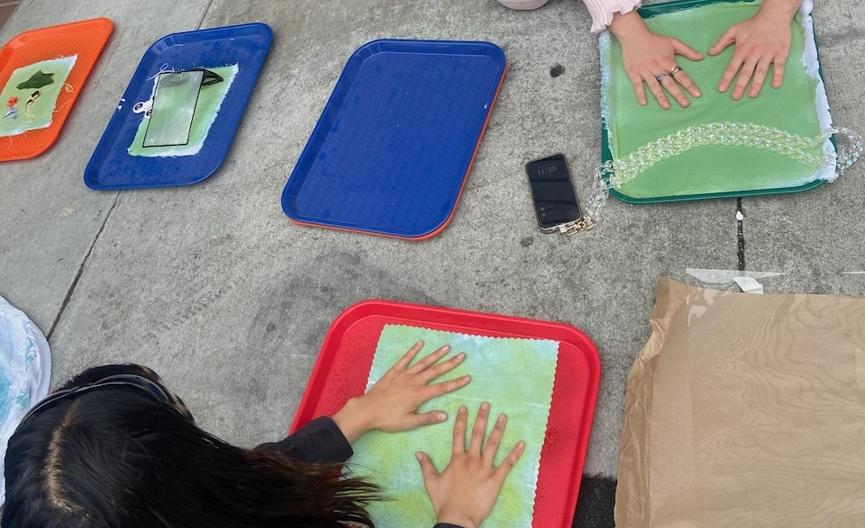
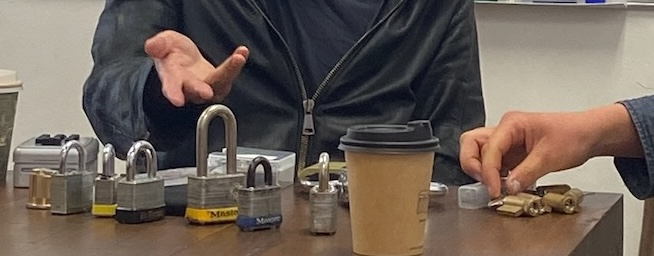
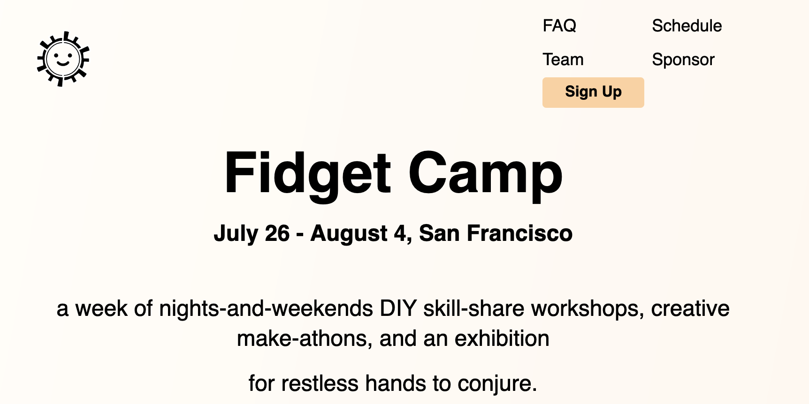
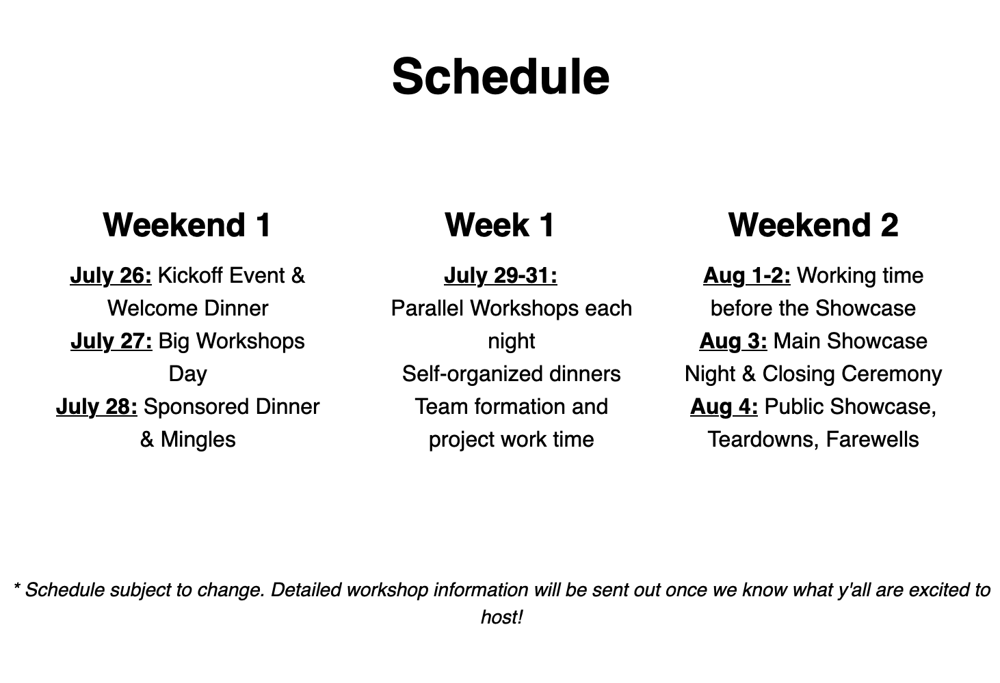

`a week of nights-and-weekends DIY skill-share workshops, creative make-athons, and an exhibition for restless hands to conjure.`
{style="margin: 0 auto;"}

Having just moved back to San Francisco, I wanted to check out the maker / creative tech scene. A Fidget Camp call-for-makers link was shared in a Discord I'm a part of. Perfect!

There were classes taught by other attendees, followed by a group exhibition of work to wrap things up. It checked off a goal of mine, to show something I made in a group show.

## Some classes I took
### Cyanotype

### Lockpicking

