`Follow a vision to completion - a light that is the post itself.`

Moving through the desert, we encounter remnants of other humans. It is trash dumped, lost items bounced out of a truck bed, or target practice.

The other night, on a sunset ride, I encountered a 4"x4" post on it's side.  It was weathered, and had a small hex head bolt in it. There was a crack that ran most of one side of it. I envisioned light coming out of it, and rode back to camp with it.

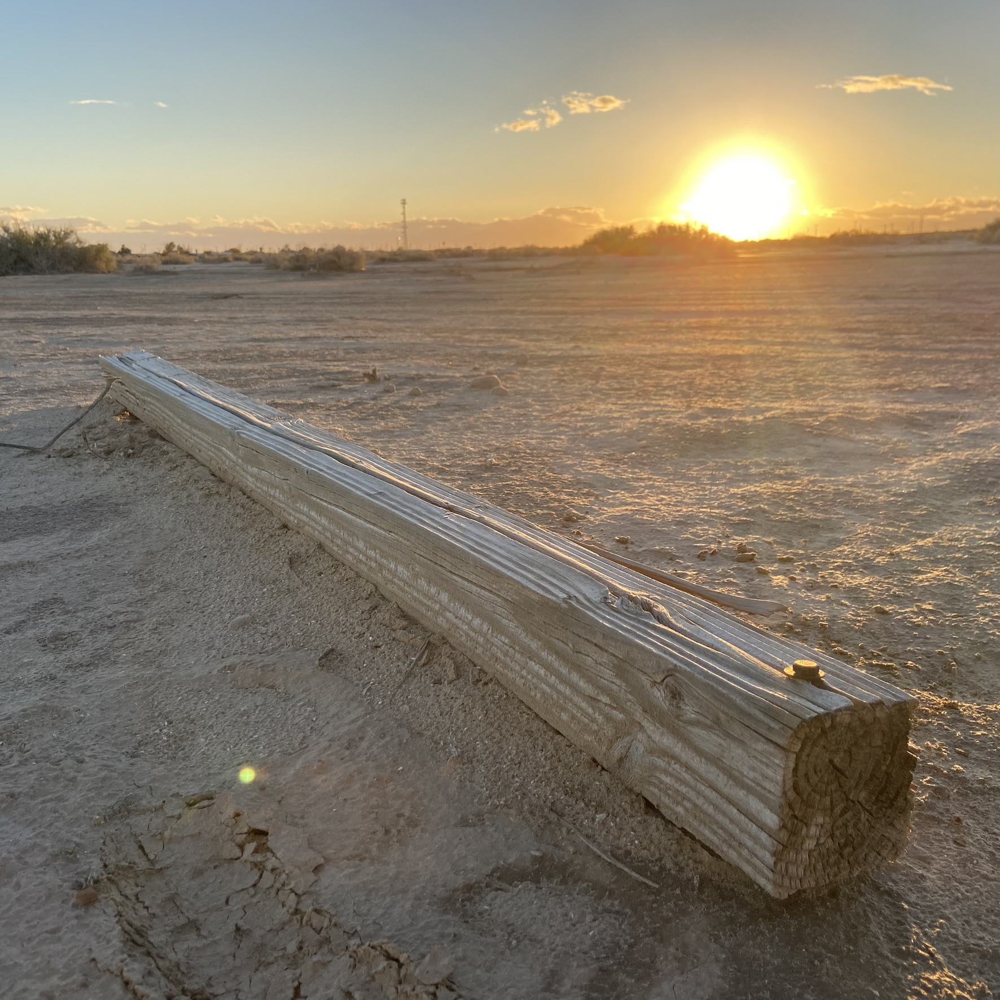
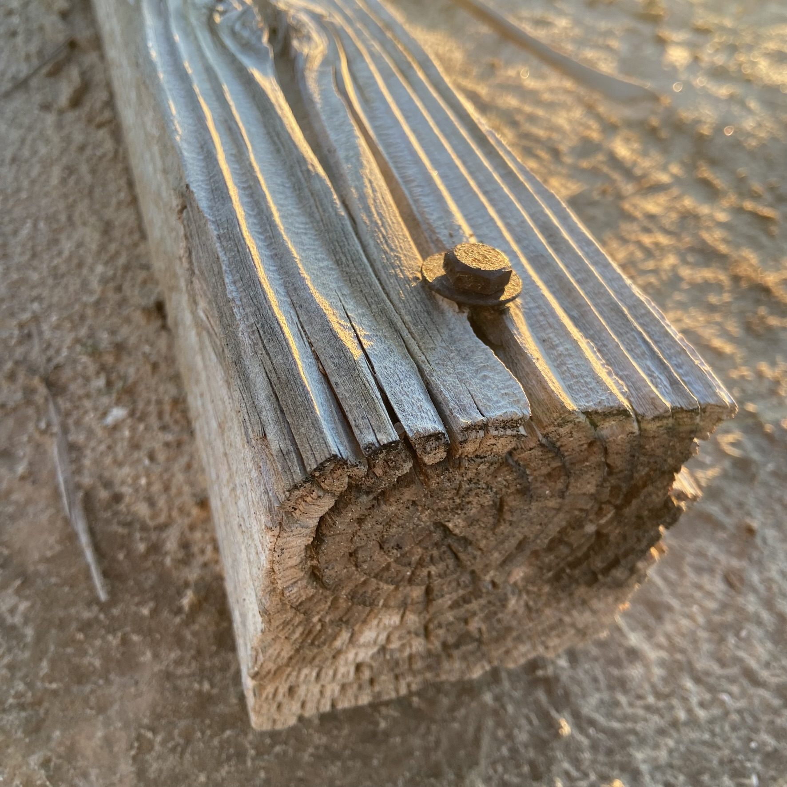
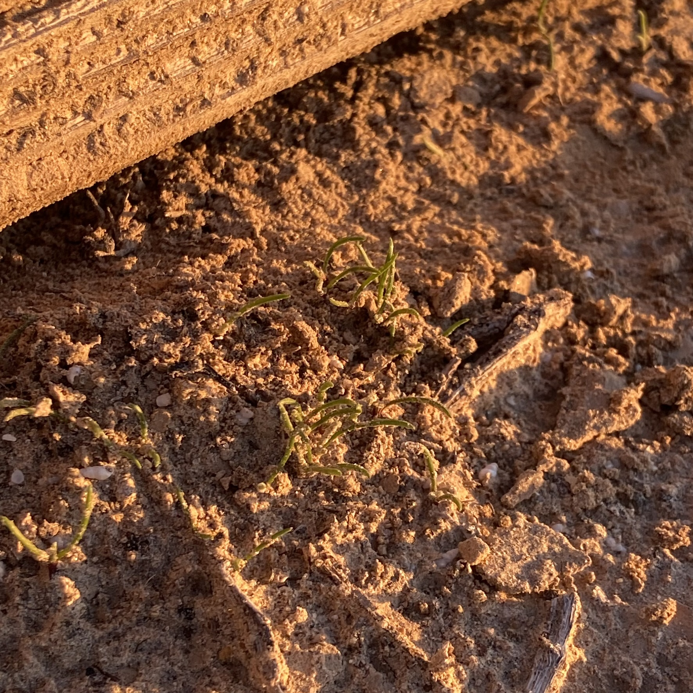

The next day I declared calendar bankruptcy, and ignored most events. My goal was singular - LP-01 (Light Post 01) by sundown.

I used the [low-workbench](low-workbench.md) I built to process the post. I used a circular saw and a jig saw for all the cuts. A router to create a mortise for the light switch.

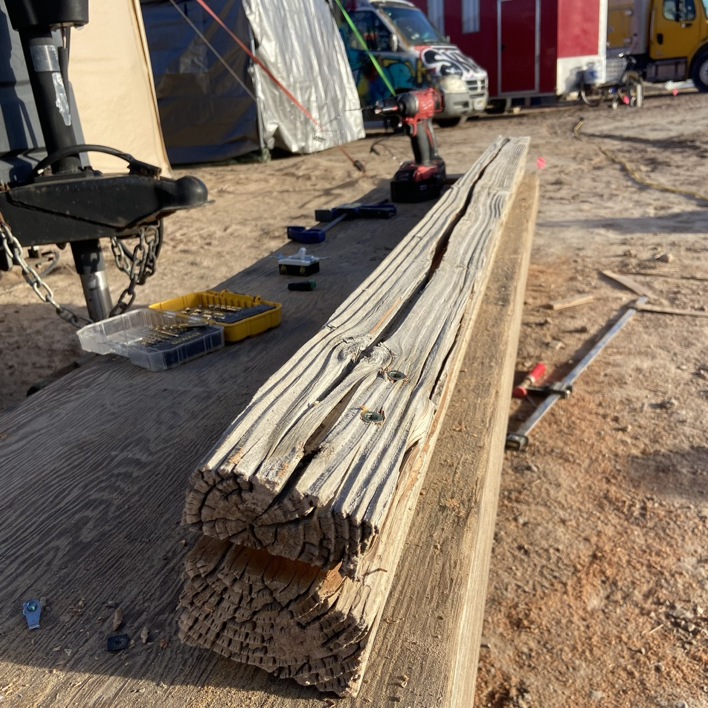
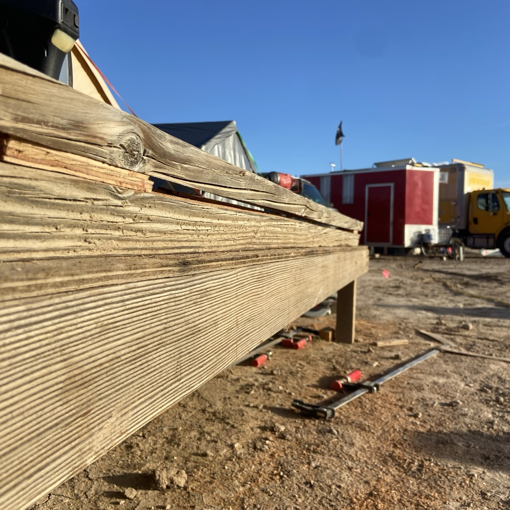
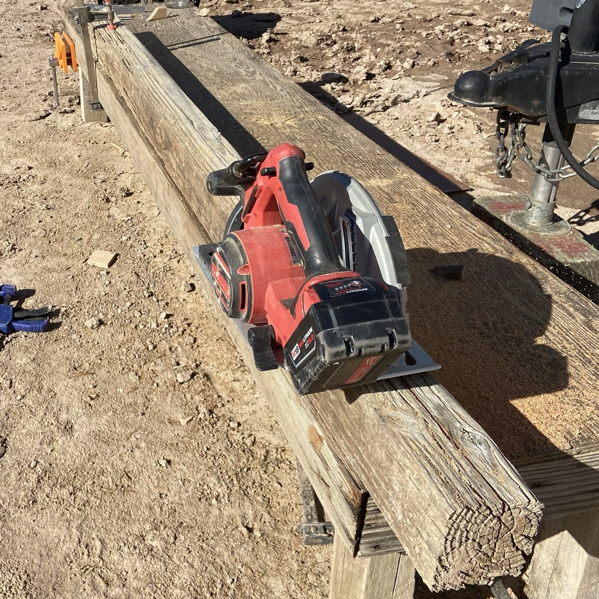

Inside is a 12v LED strip wired in to a light switch and a barrel plug connector. I used 1/4"-20 threaded inserts to cleanly bolt the face of the wood on to the back.

I created this as bolt on for modularity. I intend to create a refined version of this so that I can make several. I foresee an installation with several of these posts and other found objects all powered by solar. 

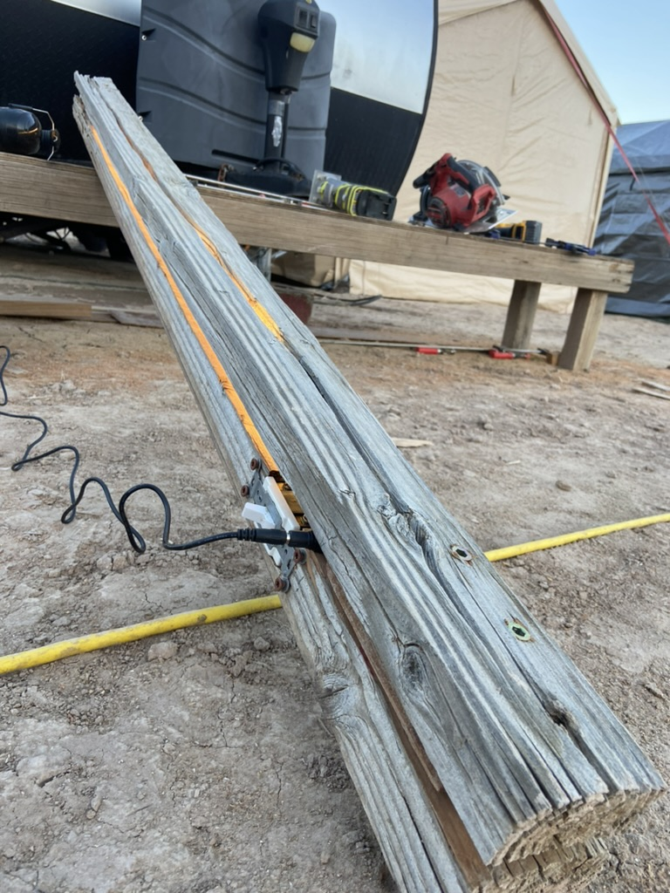

Here are some finished images from just after sunset.

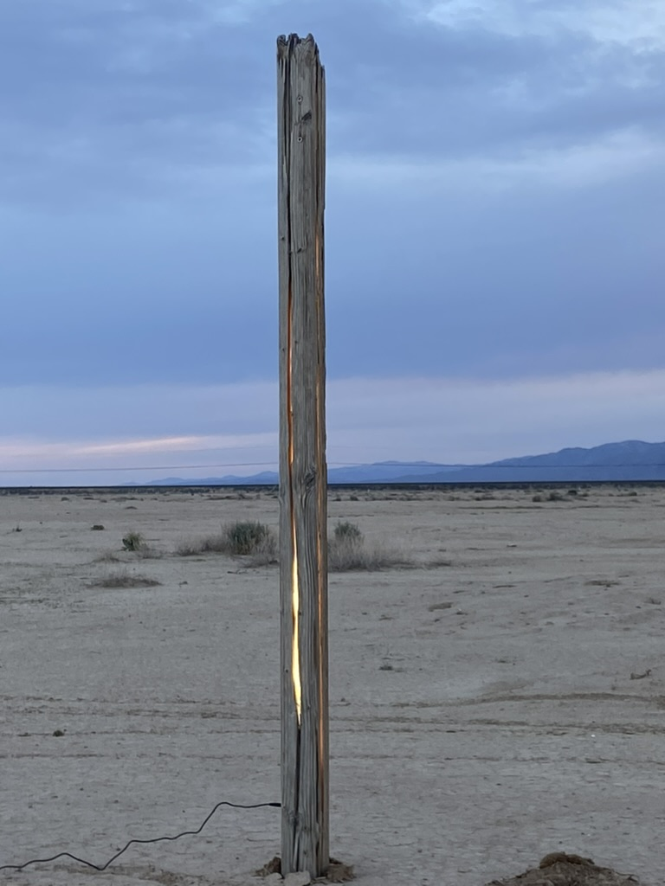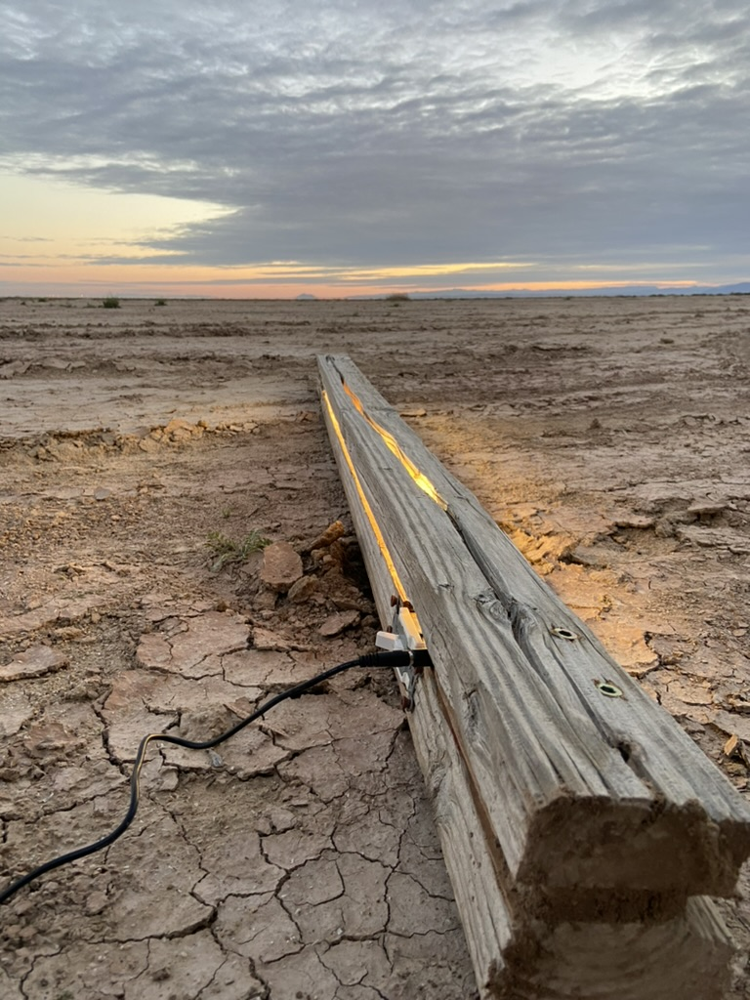
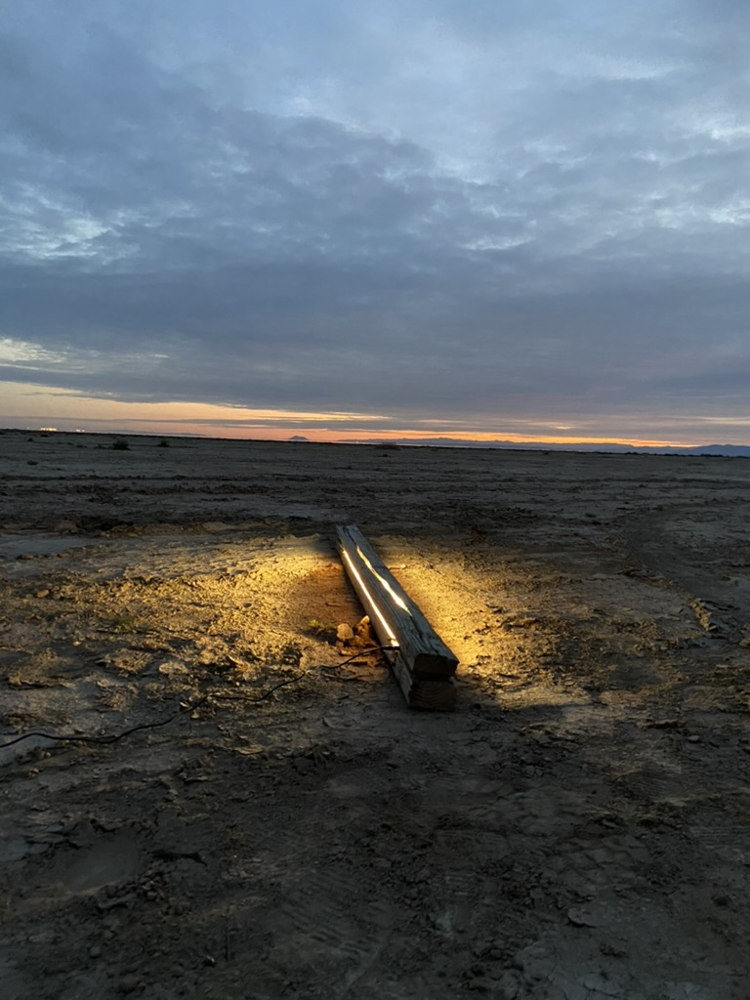

<video src="../../public/attachments/lp-01-demo.mp4" />

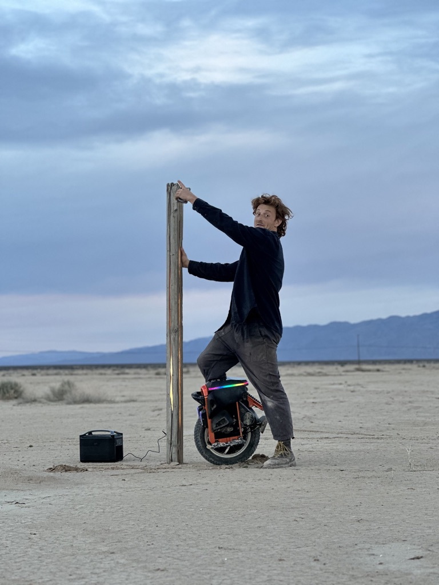
> portrait by [Ygor Marotta](https://www.instagram.com/ygormarotta/?hl=en)

