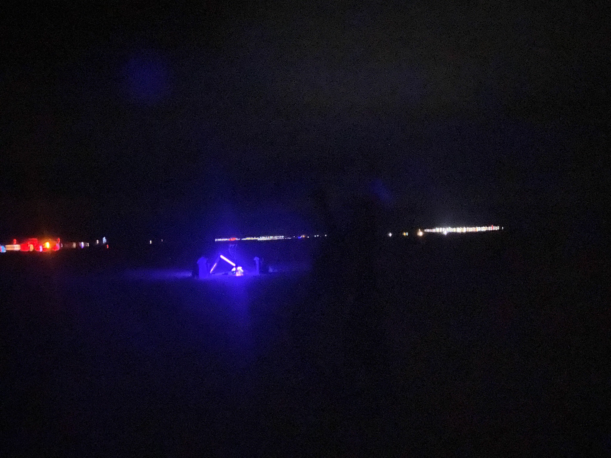

Sometimes, to be perceived as legit, all something needs is a sign.

## Here are some signs I've made (and documented)

### Game Show Game Show Game Show
March 2023 - Bombay Beach Bienalle
This was done for my friend Joe, who does the Game Show Game Show Game Show!
https://www.instagram.com/gameshowgameshowgameshow/

### Bombay Beachy Yami Ichi
March 2023 - Bombay Beach Bienalle
This was done for the internet Yami ichi at the Bombay Beach Bienalle https://www.bbyi.fyi/

`photo taken in 2024 after weathering a wet Bombay Beach summer and winter`

### Mimos Cafe
February 2023 - Mars College
Laser cut wood. Screws. Glue. Paint. AI assisted font creation.
For a popup cafe in Bombay Beach

### bbbbistro
2023 Bombay Beach Bienalle
Laser cut plywood, paint, digital design.

### Poetry House
March 2023 - Bombay Beach Bienalle
For Pharao poetry

### BlackLightAngle
 February 2024 - Mars College.
Ok this one is a stretch to call a sign, but it's a symbol for the DarkArts (listening to music in the dark windy desert night). This was a #onedaybuild

### Kamar Taj / ASMR
March 2023 - Bombay Beach
Two signs in one image 
1. The big `AS` in the background are repaired and repurposed from Luke's Mars project (the letters originally were aligned to say MARS). I mended the signs with a welder and re-bolting 2x6s for rigidity.
2. A laser engraved sign for Kamar Taj sanctuary.

### New Design Row
From November 2022, when I still worked at Glowforge. We had a section of the office called Design Row, that was moved, so I made a sign that said New Design Row. Not at all related to my job responsibilities as a software engineer for them. One of the best perks of working at Glowforge was getting to use a Glowforge, and seeing what everyone else was making. 

