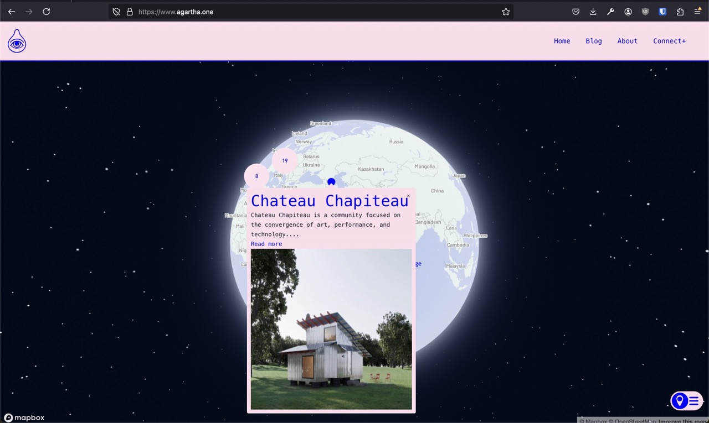

###### See it live
https://agartha.one

###### What I did
- contracted to update the https://agartha.one website. 
- added a 3D map with MapBox and better UI rendering to navigate communities
- Use Notion database as backend. Notion was used to keep track of communities, but there existed a separate Firebase database for use on the website. Rather than duplicating data, use Notion as backend.
	- Because this uses Next.js, we can cache the results 

###### Technologies
- React, MapBox, Notion

