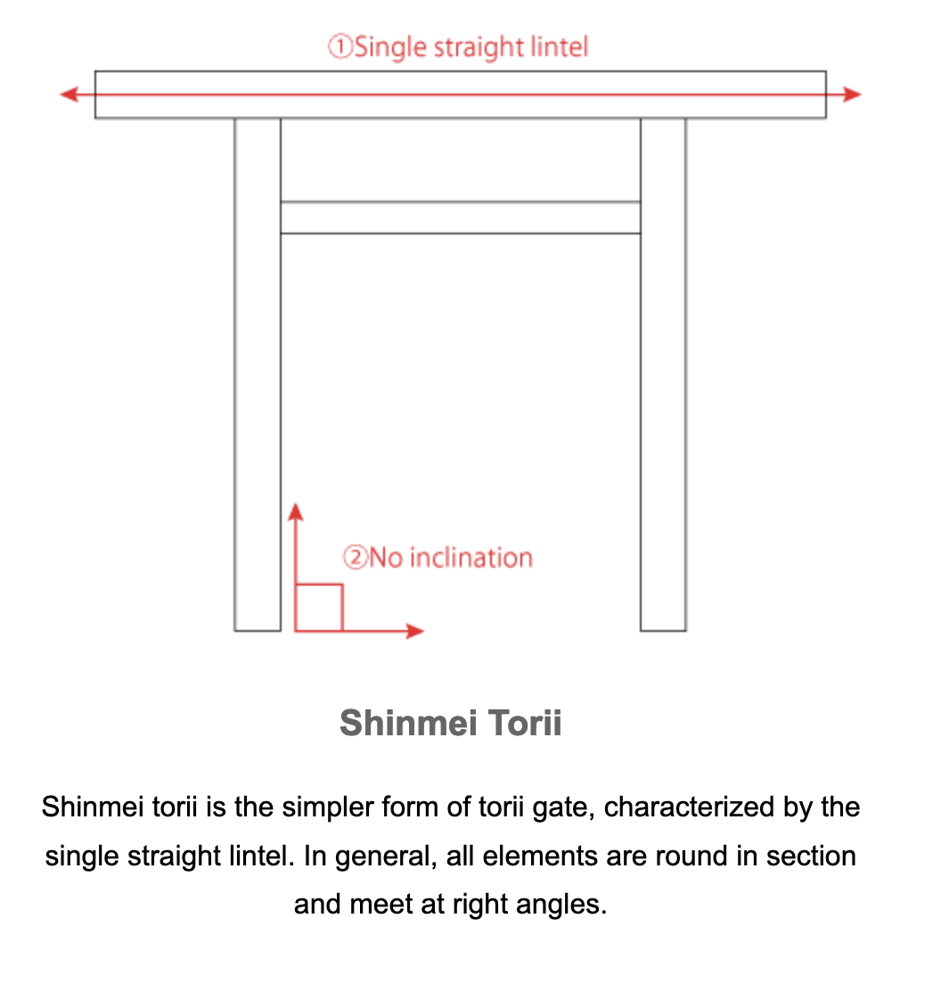

A 12' wide steel gate, using pallet rack uprights as the frame.

## Materials
- 1" steel tube, found steel.
- j-bolt hinges to bolt through pallet rack uprights.
.jpeg)
.jpeg)

	

## Inspo - torii gate
Shinto shrine inspo - torii gate
https://en.wikipedia.org/wiki/Shinto

Indigenous to Japan
> There is no central authority in control of Shinto, with much diversity of belief and practice evident among practitioners.

> A [polytheistic](https://en.wikipedia.org/wiki/Polytheism "Polytheism") and [animistic](https://en.wikipedia.org/wiki/Animism "Animism") religion, Shinto revolves around supernatural entities called the _[kami](https://en.wikipedia.org/wiki/Kami "Kami")_ (神). The _kami_ are believed to inhabit all things, including forces of nature and prominent landscape locations. The _kami_ are worshipped at _[kamidana](https://en.wikipedia.org/wiki/Kamidana "Kamidana")_ household shrines, family shrines, and [_jinja_ public shrines](https://en.wikipedia.org/wiki/Shinto_shrine "Shinto shrine"). The latter are staffed by priests, known as _[kannushi](https://en.wikipedia.org/wiki/Kannushi "Kannushi")_, who oversee offerings of food and drink to the specific _kami_ enshrined at that location. This is done to cultivate harmony between humans and _kami_ and to solicit the latter's blessing. Other common rituals include the _[kagura](https://en.wikipedia.org/wiki/Kagura "Kagura")_ dances, [rites of passage](https://en.wikipedia.org/wiki/Rites_of_passage "Rites of passage"), and seasonal festivals. Public shrines facilitate forms of [divination](https://en.wikipedia.org/wiki/Divination "Divination") and supply religious objects, such as [amulets](https://en.wikipedia.org/wiki/Amulet "Amulet"), to the religion's adherents. Shinto places a major conceptual focus on ensuring purity, largely by cleaning practices such as ritual washing and bathing, especially before worship. Little emphasis is placed on specific moral codes or particular afterlife beliefs, although the dead are deemed capable of becoming _kami_. The religion has no single creator or specific doctrine, and instead exists in a diverse range of local and regional forms.

https://www.japan-architecture.org/torii-gate/