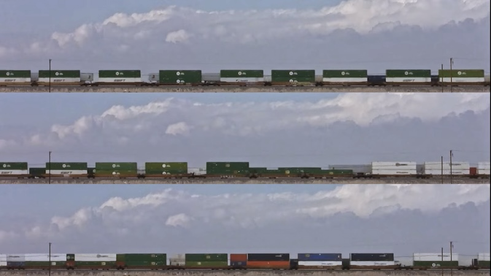

At Bombay Beach in California's Sonoran desert, two cargo trains pass by, their powerful engines interrupting the serene silence with a reminder of industry and technological advancement.  
  
We pause to observe the contrast between the raw power of the trains and the natural beauty of the landscape, and observe the interplay between silence and noise, monotony and change, the past, present, and future. 
{style="width: 100%; height: 20vh; object-fit: contain; margin: 1rem auto;"}
Shot on February 4th, 2024 as part of a larger train observation project at [Mars College](Mars%20College.md).

<iframe width="100%" height="315" src="https://www.youtube-nocookie.com/embed/gypJ9lG9fio?si=BDcRu1vVStR_Kuim" title="YouTube video player" frameborder="0" allow="accelerometer; autoplay; clipboard-write; encrypted-media; gyroscope; picture-in-picture; web-share" referrerpolicy="strict-origin-when-cross-origin" allowfullscreen></iframe>

## Further
[Train Otaku Training](Train%20Otaku%20Training.md) - using machine learning to count trains. 

## Inspo

 [The Chemical Brothers - Star Guitar ](https://www.youtube.com/watch?v=0S43IwBF0uM)
 - Solar Sam Shared - music video filmed out of train window, things passing by match up with song

