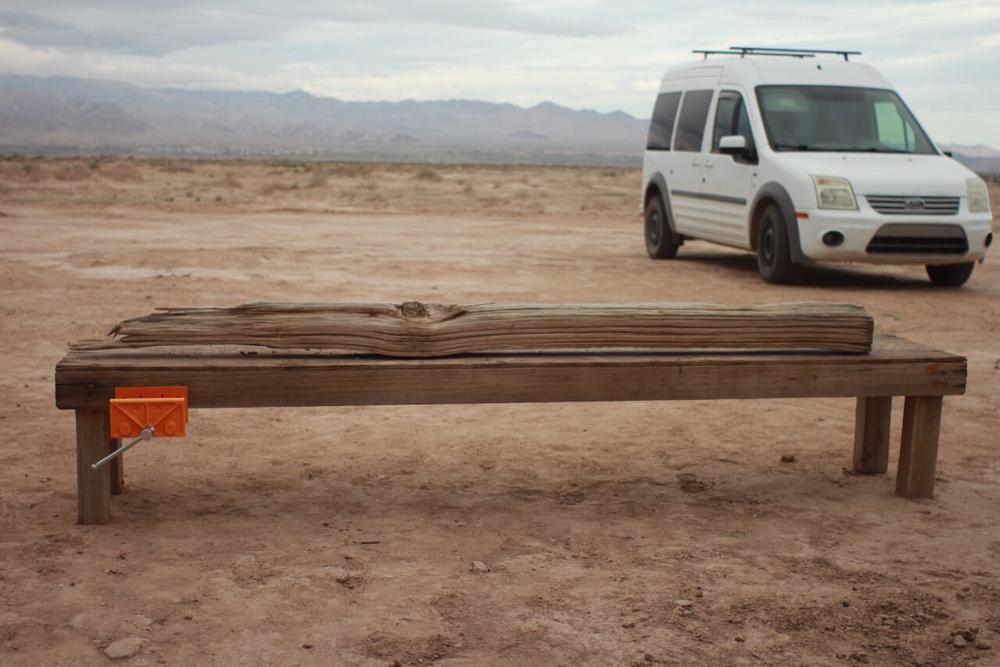

A simple workbench made of found and reclaimed lumber.

It is the exact height as a 17gallon Home Depot tote - this allows for the workbench to be extended for work-holding purposes.

Used as part of my off-grid desert workshop. Made the [LP-01](LP-01.md) project on this. And several home improvement projects during the 2024 [Mars College](Mars%20College.md) season.

{style="width: 100%;"}