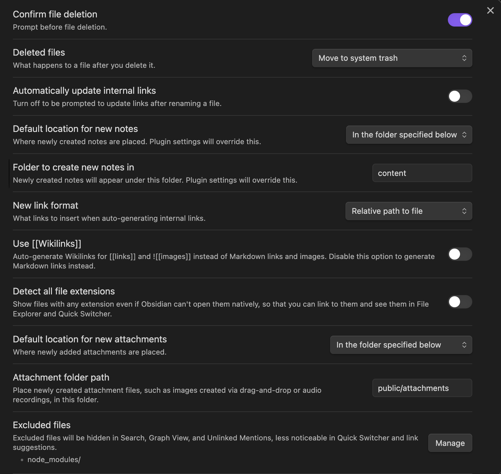

This site is built with Nuxt, with pages defined in Markdown. I use Obsidian as my markdown editor so I wanted to use it for this project.

### Obsidian Settings
Obsidian required a few tunings:
1. Open the whole Nuxt proejct as an Obsidian vault. Markdown lives in `/content`, and images live adjacent in `/public/attachments`. 
	{style="max-width:400px; margin: 1rem 0;"}
2. **Optional** the [Obsidian Consistent Attachments and Links](https://github.com/dy-sh/obsidian-consistent-attachments-and-links) plugin allows for easy refactoring of an existing Obsidian vault. I used this to migrate my attachments to the `public/attachments` directory.


### Nuxt Configuration

Lets start with [Nuxt Content](https://content.nuxt.com/). This allows us to write Markdown in the `/content` directory.
It is not immediately compatible with Obsidian out of the box, though relatively simple after some digging and trial/error.
#### File naming
The first issue we run into is file naming conventions. I am usually not one to use spaces in my file names, but Obsidian works this way. Nuxt Content transforms links with spaces in an odd way. The easiest path forward I found was to modify the links prior to parsing in the [content:file:beforeParse](https://content.nuxt.com/recipes/hooks) hook. Nuxt Content does this sluggification, so this find and replace is just copying that format.

This file is named `simons.dev - Nuxt Content + Obsidian.md`, and Nuxt creates an url slug of `/simons.dev-nuxt-content-+-obsidian`.
```json
// .nuxt/content-cache/content-index.json
"/simons.dev-nuxt-content-+-obsidian":["content:simons.dev - Nuxt Content + Obsidian.md"]
```

```ts
// server/plugins/content.ts
export default defineNitroPlugin((nitroApp) => {
  nitroApp.hooks.hook("content:file:beforeParse", (file) => {
    if (file._id.endsWith(".md")) {
	  /* 
		replace all spaces with -
		if multiple dashes in a row, replace with single dash
		strip .md from end of link
	  */
      const markdownLinkRegex = /\[([^\]]+)\]\(([^)]+)\)/g;
      file.body = file.body.replace(markdownLinkRegex, (match, text, url) => {
        const updatedUrl = url
          .toLowerCase()
          .replace(/%20/g, "-")
          .replace(/\s+/g, "-")
          .replace(/-+/g, "-")
          .replace(/\.md$/, "");
        return `[${text}](${updatedUrl})`;
      });

	  /*
		The Obsidian setup uses relative paths, so our linked images
		look like '../../public/attachments/image.png'.
		This find and replace strips out public and everything prior.
		The link becomes '/attachments/image.png', which allows
		the image to load correctly in the browser.
	  */
      const markdownImageRegex = /!\[([^\]]*)\]\(([^)]+)\)/g;
      file.body = file.body.replace(markdownImageRegex, (match, altText, imageUrl) => {
        const updatedImageUrl = imageUrl.replace(/^.*?\/public/, '');
        return ``;
      });
    }
  });
  nitroApp.hooks.hook("content:file:afterParse", (file) => {
    if (file._id.endsWith(".md")) {
      // console.log(file.body);
    }
  });
});

```


